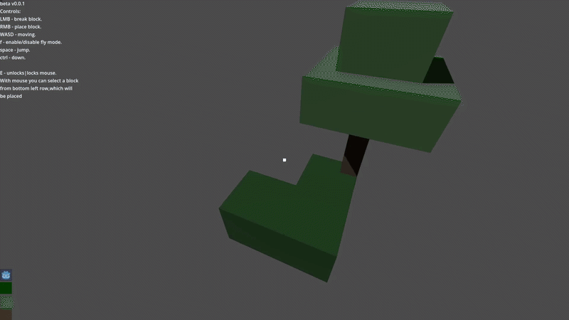

# Godot Skyblock
A simple minecraft clone written in godot. Currently in beta.


## Requirements
This project was tested on v4.6.1 of Godot.

## How to open|run project
Download project.
```bash
git clone https://github.com/SAANN3/godot-skyblock
```
Then via godot, import this project, by opening `project.godot`

## Usage
At current state, this game is very far from 'completed' state, so when i have a free time i will try to develop it and add features.

Altough maybe you can learn something from it, i tried commenting most of the stuff that i wrote.
Current project structure is:
```bash
.
├── geometry      # A geometry code for vertices, slightly modified version of https://github.com/SAANN3/godot-mesh-road.
├── levels        # Aka maps, in case if i use different generated maps. 
├── objects       # Related to objects folder, which will store all functional things, that player may see.
│   ├── player    # Player code / scene.
│   └── scenes    # scenes for objects, for example a node3d instance that acts as block. Gonna extend this later.
├── services      # Logic classes that i couldn't fit into `objects` folder.
│   └── resources # Folder for ResourceService, which defines data structures.
├── ui            # Ui elements.
├── storage       # Folder from which at the start items gonna be loaded. In future can be created something like 'mods' folder inside storage.
│   └── objects   # There are stored resources, related to objects, which are loaded upon startup.
└── types         # Types that i needed for my preference.
	├── optionals # As gdscript doesn't support generics, i have copied main class 'Optional' and slightly changed it, according to given type.
	└── tuples    # Same here but for tuples.
```

## License
Copyright (c) SAANN3 <95036865+SAANN3@users.noreply.github.com>

This project is licensed under the MIT license ([LICENSE] or <http://opensource.org/licenses/MIT>)

[LICENSE]: ./LICENSE
